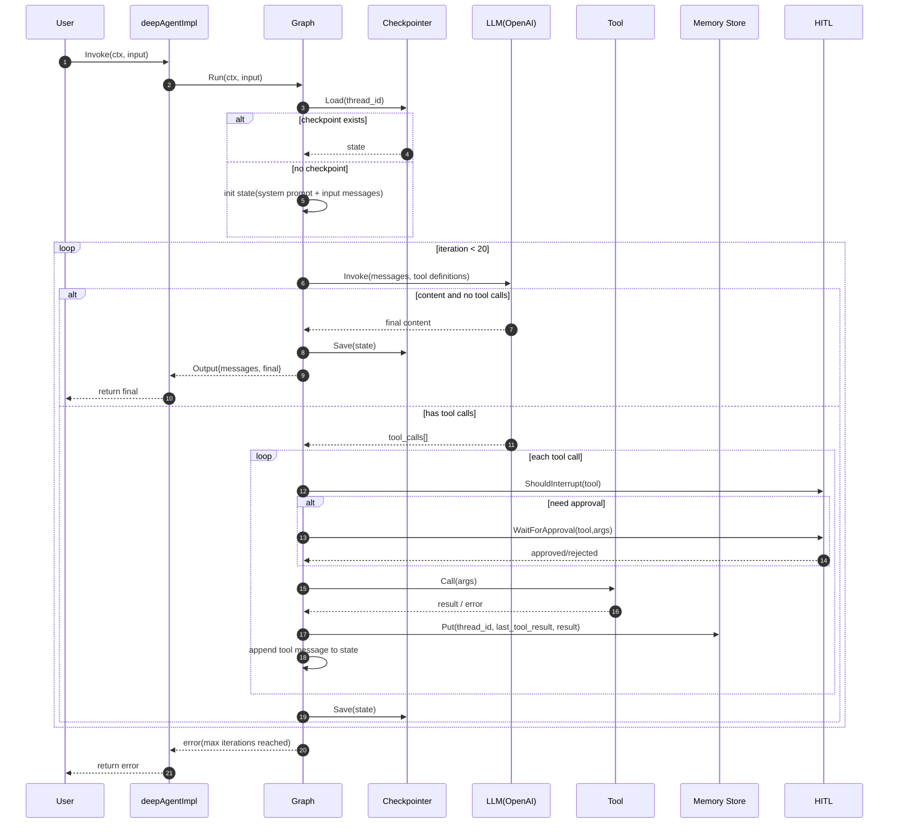

# DeepAgent Invoke 时序图

本文描述 `CreateDeepAgent(...).Invoke(...)` 的主执行链路，基于当前代码实现（`agent/deepagent.go` + `agent/graph.go` + `llms/openai/openai.go`）。

## 1) 初始化阶段（CreateDeepAgent）

`CreateDeepAgent(opts)` 会完成：

- 填充默认组件：`LLM`、`Backend`、`Checkpointer`、`Memory`、`HitlConfig`
- 加载 `skills/*.md` 并拼接到系统提示
- 组装工具集合（用户工具 + 内置工具）
- 构建 `Graph` 并返回 `DeepAgent`

## 2) 运行阶段（Invoke -> Graph.Run）

## 3) 关键实现细节

- 当前最大迭代次数是 `20`（见 `agent/graph.go`）。
- `Stream` 当前是基于 `Invoke` 的轻量包装，只在结束时返回 `final` 或 `error` 事件，不是逐 token/逐 tool 流式。
- tool 参数 schema 在 `Graph` 到 LLM 的转换中暂时传 `nil`，OpenAI 侧会落到空对象 schema（`llms/schema.go` 有完整 schema 生成能力，可继续接入）。
